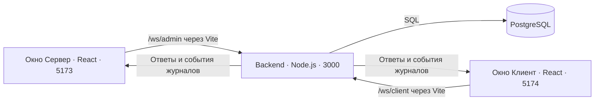
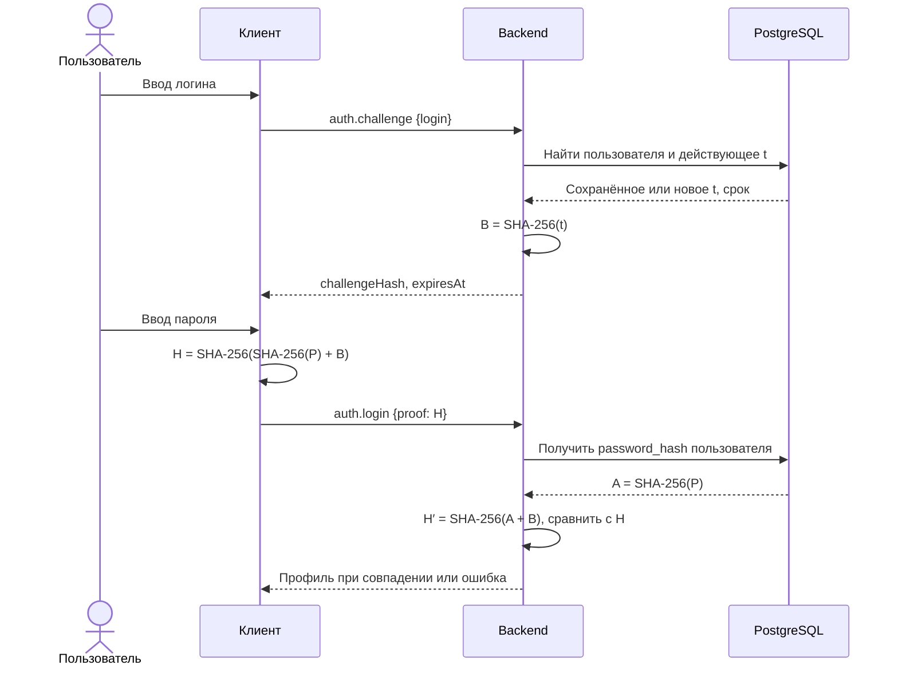

# Как устроена система и работает код

Этот документ объясняет текущую реализацию учебного проекта: создание пользователей, параметры RSA, двухэтапный вход через SHA-256 и вывод этапов в интерфейс. Инструкции запуска находятся в [README](README.md).

## 1. Части системы

В проекте два браузерных приложения, один backend и база PostgreSQL. Окно «Сервер» — это интерфейс управления: вычисления и SQL-запросы выполняет отдельный процесс Node.js.



Порты на схеме соответствуют стандартной конфигурации разработки. Браузер подключается к адресу своего приложения, а Vite перенаправляет `/ws` на backend. Backend не раздаёт HTML: обычный HTTP-запрос к нему получает 404. Переход на WebSocket обрабатывается отдельно через событие `upgrade`.

| Файл                                                                                                 | За что отвечает                                                     |
| ---------------------------------------------------------------------------------------------------- | ------------------------------------------------------------------- |
| [apps/backend/src/index.ts](apps/backend/src/index.ts)                                               | Запуск: настройки, пул БД, миграции, сервер и корректное завершение |
| [apps/backend/src/config.ts](apps/backend/src/config.ts)                                             | Чтение `.env`, адрес БД, порт и разрешённые Origin                  |
| [apps/backend/src/server.ts](apps/backend/src/server.ts)                                             | HTTP upgrade, список серверных соединений и закрытие сервера        |
| [apps/backend/src/transport/connection.ts](apps/backend/src/transport/connection.ts)                 | Приём запросов, ответы, блокировка параллельных операций и рассылка |
| [apps/backend/src/protocol/schemas.ts](apps/backend/src/protocol/schemas.ts)                         | Проверка оболочки запроса и payload через Zod                       |
| [apps/backend/src/protocol/errors.ts](apps/backend/src/protocol/errors.ts)                           | Ошибки операций и их преобразование в ответы                        |
| [apps/backend/src/database/pool.ts](apps/backend/src/database/pool.ts)                               | Пул соединений PostgreSQL                                           |
| [apps/backend/src/database/migrations.ts](apps/backend/src/database/migrations.ts)                   | Миграции схемы БД                                                   |
| [apps/backend/src/auth/session.ts](apps/backend/src/auth/session.ts)                                 | AuthSession: выдача challenge, вход, профиль и выход                |
| [apps/backend/src/auth/challenge-repository.ts](apps/backend/src/auth/challenge-repository.ts)       | Транзакционное получение и обновление t                             |
| [apps/backend/src/auth/crypto.ts](apps/backend/src/auth/crypto.ts)                                   | SHA-256, генерация t, вычисление и сравнение proof                  |
| [apps/backend/src/auth/journal.ts](apps/backend/src/auth/journal.ts)                                 | Группировка логов и разделение клиентских и серверных значений      |
| [apps/backend/src/users/admin-session.ts](apps/backend/src/users/admin-session.ts)                   | Черновик RSA и операции управления пользователями                   |
| [apps/backend/src/users/repository.ts](apps/backend/src/users/repository.ts)                         | SQL-запросы создания, списка и поиска пользователей                 |
| [apps/backend/src/users/model.ts](apps/backend/src/users/model.ts)                                   | Тип записи БД и преобразования toProfile/toUser                     |
| [apps/backend/src/users/rsa.ts](apps/backend/src/users/rsa.ts)                                       | Генерация параметров RSA                                            |
| [apps/client/src/App.tsx](apps/client/src/App.tsx)                                                   | Композиция экрана клиента                                           |
| [apps/client/src/hooks/useAuth.ts](apps/client/src/hooks/useAuth.ts)                                 | Состояние формы, этапы входа, таймер и выход                        |
| [apps/client/src/components/LoginForm.tsx](apps/client/src/components/LoginForm.tsx)                 | Отображение двух шагов формы входа                                  |
| [apps/client/src/components/ProfileCard.tsx](apps/client/src/components/ProfileCard.tsx)             | Профиль и кнопка выхода                                             |
| [apps/client/src/crypto.ts](apps/client/src/crypto.ts)                                               | SHA-256 в браузере через Web Crypto                                 |
| [apps/server-ui/src/App.tsx](apps/server-ui/src/App.tsx)                                             | Композиция серверного экрана                                        |
| [apps/server-ui/src/hooks/useUserManagement.ts](apps/server-ui/src/hooks/useUserManagement.ts)       | Загрузка пользователей, генерация RSA и отправка формы              |
| [apps/server-ui/src/components/CreateUserForm.tsx](apps/server-ui/src/components/CreateUserForm.tsx) | Форма создания пользователя                                         |
| [apps/server-ui/src/components/UserList.tsx](apps/server-ui/src/components/UserList.tsx)             | Список пользователей                                                |
| [apps/server-ui/src/components/RsaParameters.tsx](apps/server-ui/src/components/RsaParameters.tsx)   | Просмотр и копирование параметров RSA                               |
| [packages/shared/src/index.ts](packages/shared/src/index.ts)                                         | Общие типы запросов, ответов, профиля и логов                       |
| [packages/ui/src/connection.ts](packages/ui/src/connection.ts)                                       | Публичные экспорты транспорта и хука                                |
| [packages/ui/src/transport/Connection.ts](packages/ui/src/transport/Connection.ts)                   | Браузерный WebSocket-транспорт, ответы и переподключение            |
| [packages/ui/src/hooks/useConnection.ts](packages/ui/src/hooks/useConnection.ts)                     | Связь транспорта с React-состоянием и журналом                      |
| [packages/ui/src/AuthJournal.tsx](packages/ui/src/AuthJournal.tsx)                                   | Общий компонент отображения журнала                                 |

Проект собран через npm workspaces: приложения используют общие пакеты `@app/shared` и `@app/ui`. TypeScript проверяет согласованность типов при разработке, а Zod в backend проверяет фактически полученные сообщения во время работы.

### Границы модулей после рефакторинга

Backend устроен по цепочке: транспорт → сессия соответствующего канала → репозиторий или криптографическая функция. В транспорте нет SQL и вычисления H; сессии не отправляют WebSocket-сообщения напрямую. Каждому соединению создаётся собственный экземпляр `AuthSession` или `AdminSession`. Функция `isConnected` позволяет не сохранять результат асинхронной операции в уже закрытую сессию.

В интерфейсах `App.tsx` собирает страницу, `hooks` управляют состоянием и запросами, `components` отображают данные и вызывают переданные обработчики. Класс `Connection` не зависит от React; `useConnection` подключает его к жизненному циклу компонента. Общий файл `connection.ts` сохраняет прежний путь импорта пакета.

## 2. Запуск и хранение данных

При запуске `index.ts` создаёт пул соединений PostgreSQL, вызывает `migrate`, создаёт приложение через `createApplication` и начинает слушать адрес `127.0.0.1`. При завершении процесса закрываются WebSocket-соединения, HTTP-сервер и пул БД.

Миграции выполняются в транзакции. Блокировка `pg_advisory_xact_lock` не даёт двум запускающимся экземплярам одновременно менять схему. Таблица `schema_migrations` содержит номера уже выполненных миграций: повторный запуск не пересоздаёт данные.

| Таблица             | Содержимое                                                                             |
| ------------------- | -------------------------------------------------------------------------------------- |
| `schema_migrations` | Версия миграции и время применения                                                     |
| `users`             | UUID, уникальный логин, `password_hash`, Telegram-логин, параметры RSA и дата создания |
| `auth_challenges`   | Одна запись на пользователя: `user_id`, байты `t`, `created_at`, `expires_at`          |

Первая миграция создаёт пользователей, вторая — challenge. Поле `password_hash` содержит 64 символа hex, то есть SHA-256 пароля. Исходного пароля в БД нет. Поле `t` имеет тип `bytea` и ограничение длины ровно 16 байтов. Внешний ключ с `ON DELETE CASCADE` удаляет challenge вместе с пользователем.

Функция `toProfile(row)` возвращает только публичные поля профиля. Функция `toUser(row)` добавляет параметры RSA для серверного интерфейса. Обе явно собирают ответ, поэтому `password_hash` из записи БД не попадает в список пользователей или профиль.

## 3. Как создаётся пользователь

1. В серверном окне вводятся логин, пароль и Telegram-логин.
2. Кнопка генерации отправляет `rsa.generate`. Backend генерирует RSA-2048 и сохраняет параметры в переменной `draft` текущего WebSocket. Интерфейс получает параметры для просмотра.
3. Кнопка добавления отправляет `users.create` с введёнными полями. Здесь пароль передаётся backend, чтобы тот вычислил `SHA-256(пароль)` для хранения. Это отдельная операция регистрации; при последующем входе пароль уже не отправляется.
4. Сервер проверяет поля и наличие `draft`. Один SQL `INSERT` сохраняет профиль, хеш пароля и все параметры RSA вместе.
5. После успеха сервер очищает `draft`, возвращает пользователя и рассылает `users.changed` открытым серверным окнам. Они перечитывают список.

Логин чувствителен к регистру; пробелы по его краям удаляются. Пароль не обрезается и не нормализуется, поэтому пробелы в нём влияют на результат. У Telegram-логина удаляется начальный `@`; это текстовое поле, без обращения к Telegram.

RSA генерируется средствами Node.js с публичной экспонентой `e = 65537`. Код извлекает компоненты из JWK, переводит их в `BigInt` и сохраняет как десятичные строки, чтобы большие целые не теряли точность при передаче через JSON. Отдельно рассчитывается `φ(n) = (p − 1)(q − 1)`. RSA в этом проекте демонстрируется и хранится, но не участвует в вычислении H или шифровании WebSocket.

## 4. Обозначения и точная формула входа

Challenge — это значение, которое сервер выдаёт клиенту для вычисления ответа. Здесь клиенту выдаётся хеш случайного `t`.

| Обозначение | Значение в коде                                         |
| ----------- | ------------------------------------------------------- |
| `P`         | Введённый пользователем пароль                          |
| `t`         | 16 случайных байтов, то есть 128 бит                    |
| `A`         | `SHA-256(P)`; в БД это `password_hash`                  |
| `B`         | `SHA-256(t)`; в ответе сервера это `challengeHash`      |
| `H`         | Ответ клиента: `SHA-256(A + B)`; поле запроса `proof`   |
| `H′`        | Значение, независимо рассчитанное сервером по данным БД |

Все результаты SHA-256 представлены строками hex в нижнем регистре: один хеш занимает 64 символа. Знак `+` означает склеивание строк без пробела, запятой или другого разделителя.

```text
A = hex(SHA-256(UTF-8(P)))          // 64 символа
B = hex(SHA-256(t))                // 64 символа; t — исходные байты
joined = A + B                    // 128 символов, порядок строго A, затем B
H = hex(SHA-256(UTF-8(joined)))     // 64 символа
```

Внешнее хеширование получает UTF-8 текст из 128 hex-символов. Склеивание двух бинарных хешей дало бы другой результат. Аналогично, `SHA-256(t)` считается от 16 исходных байтов, а не от 32-символьного hex-представления, которое показывается в журнале сервера.

На клиенте `sha256` использует `TextEncoder`, `crypto.subtle.digest` и перевод полученных байтов в hex. `createClientProof` последовательно вызывает эту функцию для пароля и склеенной строки. На сервере `hashPassword` и `createProof` выполняют те же действия через `createHash` из `node:crypto`.

## 5. Вход по шагам



### Шаг 1: отправка логина

В `hooks/useAuth.ts` клиента отсутствие `challenge` означает первый шаг формы. При отправке создаётся идентификатор попытки, записывается локальный лог и вызывается `request('auth.challenge', { login })`.

Backend сначала сбрасывает прежнюю сессию и привязку challenge этого соединения. Затем проверяет логин и вызывает `getChallenge`. Если пользователь не найден, возвращается ошибка, поле пароля не открывается.

### Шаг 2: получение или генерация t

`getChallenge` получает отдельное соединение из пула и начинает транзакцию. Запрос пользователя содержит `FOR UPDATE`: до завершения транзакции другие запросы выдачи challenge этому пользователю ждут освобождения блокировки.

Далее функция читает `auth_challenges`. Если записи нет или `expires_at <= now()`, она генерирует `randomBytes(16)` и сохраняет новое значение через `INSERT ... ON CONFLICT ... DO UPDATE`. Иначе возвращает уже сохранённое t. Блокировка строки пользователя действует и при отсутствии записи challenge, поэтому параллельные первые запросы не создают разные значения.

Срок нового t — `now + 24 * 60 * 60 * 1000` миллисекунд. Он не продлевается при повторном запросе, неверном пароле или успешном входе. Отдельного фонового удаления нет: просроченное значение заменяется при следующем запросе логина. После `COMMIT` соединение возвращается в пул через `finally`; при ошибке выполняется `ROLLBACK`.

### Шаг 3: передача SHA-256(t)

Сервер вычисляет B и сохраняет в памяти текущего WebSocket `{ userId, hash, expiresAt }`. Эта привязка определяет, какого пользователя проверять на следующем шаге. Клиент не передаёт логин повторно вместе с proof.

Ответ содержит только `challengeHash` и `expiresAt`. Клиент сохраняет их в React-состоянии, блокирует изменение логина и открывает поле пароля. Кнопка «Сменить логин» возвращает форму на первый шаг; новый серверный контекст установится при следующей отправке логина.

### Шаг 4: вычисление H в браузере

Клиент вычисляет H по формуле выше, очищает поле пароля и отправляет `{proof: H}`. В сетевом запросе входа нет ни исходного пароля, ни отдельного A. Необходимое для вычислений Web Crypto доступно при запуске через localhost/127.0.0.1 или HTTPS.

### Шаг 5: вычисление H′ на сервере

Сервер принимает только proof из 64 lowercase hex-символов. Проверяет наличие привязки challenge и его срок, читает пользователя по сохранённому `userId` и вызывает `createProof(row.password_hash, challenge.hash)`.

Содержимое `password_hash` уже равно SHA-256 пароля. Повторно хешировать это поле отдельно перед склеиванием не нужно: это изменило бы формулу. Если пользователь между шагами был удалён, код выполняет вычисление с подставным хешем, но затем в любом случае отказывает во входе.

### Шаг 6: сравнение и сессия

`verifyProof` проверяет формат строк, переводит обе в 32-байтовые буферы и сравнивает через `timingSafeEqual`. Срок challenge проверяется ещё раз после чтения БД, чтобы ожидание запроса не позволило принять уже просроченное значение.

При совпадении и наличии пользователя `AuthSession.userId` получает его UUID. Клиент получает профиль и переключается на экран «Ваш профиль». При несовпадении возвращается `INVALID_CREDENTIALS`, сессия остаётся пустой; действующий challenge можно использовать для новой попытки ввода пароля.

## 6. Время жизни разных состояний

| Состояние                        | Где хранится                                        | Когда сбрасывается                                                                   |
| -------------------------------- | --------------------------------------------------- | ------------------------------------------------------------------------------------ |
| Пользователь и RSA               | PostgreSQL                                          | При удалении записи пользователя                                                     |
| t и срок                         | PostgreSQL                                          | t заменяется при запросе после истечения 24 часов; удаляется вместе с пользователем  |
| Привязка challenge к клиенту     | Память backend, конкретный WebSocket                | Новый запрос challenge, выход, отключение или обнаруженное истечение срока           |
| Авторизация `AuthSession.userId` | Память backend, конкретный WebSocket                | Выход, отключение, начало нового входа или отсутствие пользователя при `auth.me`     |
| Черновик RSA `draft`             | Память backend, конкретный WebSocket администратора | Успешное создание пользователя или отключение; повторная генерация заменяет черновик |
| Форма и журнал                   | React-состояние в браузере                          | По действиям интерфейса; полностью при перезагрузке страницы                         |

Истечение t не завершает уже установленную сессию. `auth.me` проверяет `AuthSession.userId` и наличие пользователя, а не срок challenge. Cookies или JWT для входа здесь не создаются. После переподключения WebSocket новый, поэтому нужно войти заново; сохранённое в БД t при этом может остаться прежним.

В клиенте таймер возвращает форму к отправке логина при истечении срока. Окончательное решение всё равно принимает backend по своим часам. Счётчик `generation` помогает игнорировать результат асинхронной операции, если форма уже была сброшена отключением, сменой логина или таймером.

## 7. Формат сообщений и транспорт

Все сообщения передаются как JSON. Запрос имеет оболочку:

```json
{
  "id": "уникальный-id-запроса",
  "type": "auth.challenge",
  "payload": { "login": "alice" }
}
```

Успешный ответ имеет вид `{id, ok: true, data}`, ошибка — `{id, ok: false, error: {code, message}}`. Совпадающий `id` позволяет связать ответ с запросом.

| Канал        | Операция         | Входной payload                    | Результат                    |
| ------------ | ---------------- | ---------------------------------- | ---------------------------- |
| `/ws/admin`  | `rsa.generate`   | `{}`                               | Параметры RSA                |
| `/ws/admin`  | `users.create`   | `{login, password, telegramLogin}` | Созданный пользователь с RSA |
| `/ws/admin`  | `users.list`     | `{}`                               | Список пользователей с RSA   |
| `/ws/client` | `auth.challenge` | `{login}`                          | `{challengeHash, expiresAt}` |
| `/ws/client` | `auth.login`     | `{proof}`                          | Публичный профиль            |
| `/ws/client` | `auth.me`        | `{}`                               | Профиль текущей сессии       |
| `/ws/client` | `auth.logout`    | `{}`                               | `null`                       |

`Connection.request` создаёт Promise и сохраняет его обработчики в `pending` под id запроса. При ответе `onmessage` находит запись, отменяет таймер и вызывает `resolve` либо `reject`. Ошибка сохраняет серверный `code`, чтобы форма могла отдельно обработать истёкший или отсутствующий challenge.

Ожидание ответа ограничено 30 секундами. Тайм-аут прекращает ожидание в браузере, но не отменяет уже начатую операцию на сервере. Поэтому после тайм-аута создания пользователя сначала проверяют список.

При закрытии WebSocket ожидающие запросы отклоняются. Если соединение не закрыто намеренно через `close()`, следующая попытка подключения происходит через 1500 мс. Запросы автоматически повторно не отправляются.

На backend флаг `busy` разрешает одну выполняющуюся операцию на соединение. `ownsBusy` не даёт отклонённому параллельному запросу снять блокировку чужой операции. Это не заменяет SQL-блокировку: разные WebSocket могут обращаться к одному пользователю одновременно.

## 8. Как работают журналы

Функция `log` из `auth/journal.ts` создаёт `AuthLog`, а транспорт отправляет событие `{type: 'auth.log', entry}`. Поля записи:

| Поле        | Назначение                                                                                          |
| ----------- | --------------------------------------------------------------------------------------------------- |
| `id`        | Уникальный идентификатор записи, также React key                                                    |
| `attemptId` | ID запроса challenge, связывающий этапы; повторные проверки с этим challenge остаются в этой группе |
| `time`      | Время в ISO; интерфейс отображает локальное время                                                   |
| `side`      | `client` или `server` — где записано действие                                                       |
| `step`      | Номер этапа 1–6                                                                                     |
| `message`   | Текст действия и разрешённые для получателя значения                                                |

Текущий клиент получает общую часть сообщения. Всем подключённым серверным окнам отправляется та же запись с дополнительным `serverDetail`: там могут находиться t и H′. Другим клиентам сервер не рассылает эту попытку.

Действия браузера — отправка логина и вычисление H — добавляются локально через `appendLog`. Они не пересылаются в серверное окно: там видны соответствующие действия backend, например получение логина и H. Поэтому содержимое двух журналов различается.

Ни исходный пароль, ни его отдельный SHA-256 в записи не добавляются. Клиент видит B, H и результат сравнения; серверное окно дополнительно показывает t в hex и H′. При ошибке могут появиться отдельные записи о неудачном сравнении и об ответе с кодом ошибки.

`useConnection` хранит последние 500 записей через `.slice(-MAX_LOG_ENTRIES)`. `AuthJournal` выводит их в область `role="log"` с прокруткой. Кнопка очистки очищает только журнал текущего окна. Выход из аккаунта не удаляет журнал; перезагрузка страницы удаляет его. События `users.changed` обрабатываются отдельно, поэтому каждый новый лог не вызывает запрос списка пользователей.

## 9. Ошибки и границы реализации

| Код                   | Причина                                                                                        |
| --------------------- | ---------------------------------------------------------------------------------------------- |
| `INVALID_REQUEST`     | Неверный JSON, поля или формат proof; старый вход с `{login, password}` тоже отклоняется       |
| `FORBIDDEN`           | Операция недоступна для данного WebSocket-канала                                               |
| `BUSY`                | Предыдущая операция этого соединения ещё выполняется                                           |
| `RSA_REQUIRED`        | Создание пользователя без черновика RSA                                                        |
| `LOGIN_EXISTS`        | Нарушена уникальность логина                                                                   |
| `INVALID_CREDENTIALS` | Пользователь не найден либо проверка H не прошла                                               |
| `CHALLENGE_REQUIRED`  | В этом соединении не был получен challenge                                                     |
| `CHALLENGE_EXPIRED`   | Достигнуто время истечения t                                                                   |
| `UNAUTHORIZED`        | Нет действующей сессии для `auth.me`                                                           |
| `DATABASE_ERROR`      | Необработанная внутренняя ошибка, включая сбой БД; технические подробности клиенту не выдаются |

Сервер проверяет Origin и путь при подключении, ограничивает входное сообщение 16 КиБ и валидирует payload строгими схемами Zod. SQL-значения передаются параметрами `$1`, `$2` и т. д. Серверный интерфейс не имеет отдельного входа администратора: права на операции определяются выбранным каналом. Это соответствует локальному учебному устройству проекта.

Повторное использование t — осознанное условие этой реализации. Для неизменного пароля и того же t значение H также одинаково: после получения challenge в новом соединении такой H снова проходит сравнение до истечения срока. Код не делает proof одноразовым. SHA-256 здесь хеширует данные, но не шифрует канал; RSA к каналу не подключён. Эти свойства полезно учитывать при объяснении того, что именно демонстрирует алгоритм.

## 10. Как проверить и читать реализацию

Для последовательного чтения начните с `apps/client/src/hooks/useAuth.ts`: обработчик `submit` показывает два шага входа. Затем перейдите к методам `issueChallenge` и `login` в `apps/backend/src/auth/session.ts`, к `getChallenge` в `auth/challenge-repository.ts` и к функциям клиентского и серверного `crypto.ts`. После этого прочитайте `transport/Connection.ts`, `hooks/useConnection.ts` и `AuthJournal`, чтобы связать сообщения с отображением.

В [crypto.test.ts](apps/backend/test/crypto.test.ts) проверяются длина t, фиксированный хеш, совпадение браузерной и серверной формулы, обработка паролей с кириллицей и пробелами, сравнение proof и параметры RSA. Браузерная функция в этом тесте вызывается в среде Node.js с Web Crypto.

В [integration.test.ts](apps/backend/test/integration.test.ts) используются настоящие PostgreSQL и WebSocket: проверяются создание пользователей, вход и ошибки, общий challenge при параллельных запросах, независимость пользователей, истечение и обновление t, чтение сохранённого challenge другим экземпляром приложения, разделение логов и сброс сессии после отключения. Тест создаёт отдельную случайную схему БД и удаляет её в конце. Часы передаются в `createApplication` параметром `now`, поэтому границу 24 часов можно проверить без ожидания суток.

```powershell
npm.cmd test
npm.cmd run typecheck
npm.cmd run lint
npm.cmd run format:check
npm.cmd run build
```

Для ручной демонстрации откройте оба окна, создайте пользователя, отправьте логин из клиента, введите сначала неверный, затем верный пароль. Сравните H и H′ в серверном журнале. После выхода снова отправьте тот же логин: до истечения срока журнал сообщит о повторном использовании t. При перезагрузке клиента потребуется повторный вход, а журнал этого окна начнётся заново.
