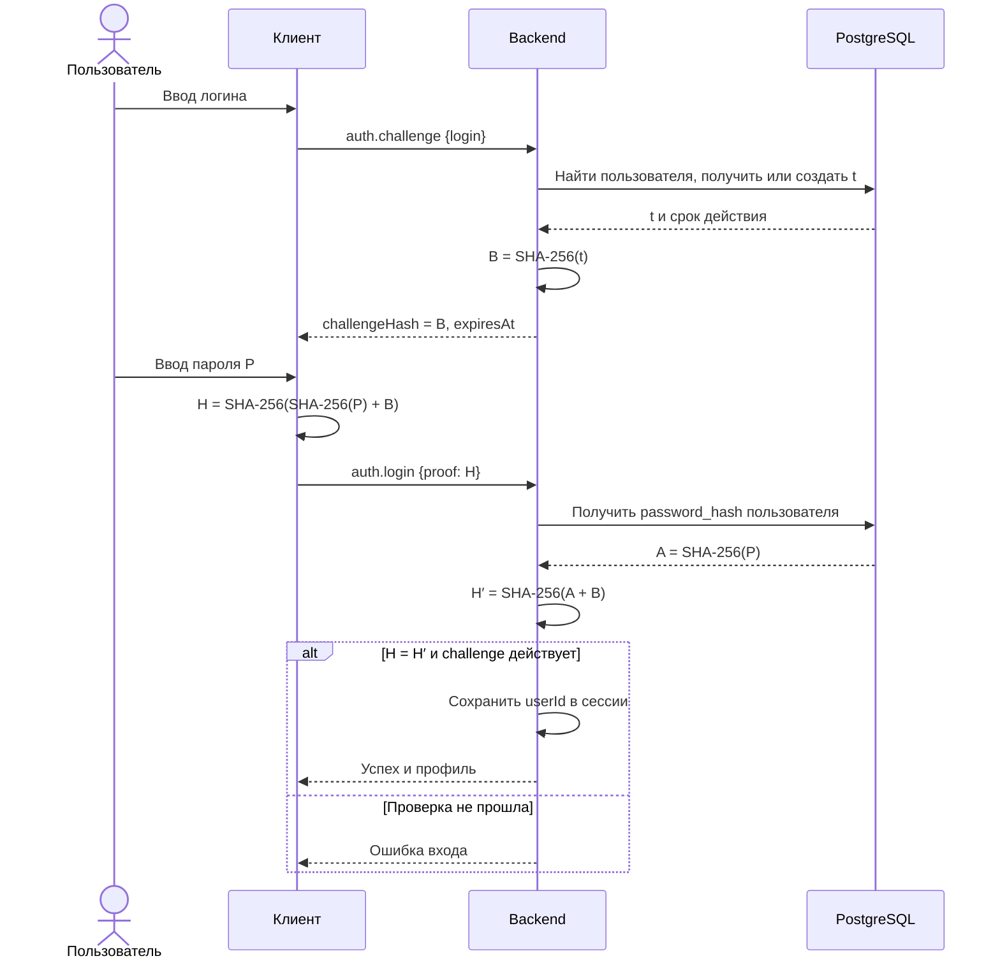

# Полный цикл аутентификации

Этот документ последовательно описывает создание пользователя, обмен при входе, вычисление хешей, установление сессии и выход. Общее устройство проекта разобрано в [ARCHITECTURE.md](ARCHITECTURE.md), команды запуска — в [README.md](README.md).

## 1. Создание пользователя

В серверном интерфейсе задаются логин и пароль, генерируются параметры RSA и создаётся пользователь. При создании backend получает пароль и вычисляет:

```ts
const passwordHash = hashPassword(password);
// SHA-256(пароль)
```

В таблицу `users` записываются логин и `password_hash`. Исходный пароль в БД не сохраняется. Параметры RSA хранятся вместе с пользователем, но в вычислении ответа при входе не участвуют.

## 2. Клиент отправляет логин

Пользователь вводит логин и нажимает **«Получить SHA-256(t)»**.

Клиент отправляет WebSocket-запрос:

```json
{
  "id": "идентификатор-запроса",
  "type": "auth.challenge",
  "payload": {
    "login": "alice"
  }
}
```

Логика клиента находится в [useAuth.ts](apps/client/src/hooks/useAuth.ts). При начале этого этапа сервер сбрасывает прежнюю авторизацию и привязку challenge текущего соединения.

## 3. Сервер получает или создаёт t

В [challenge-repository.ts](apps/backend/src/auth/challenge-repository.ts) сервер находит пользователя и проверяет его challenge в БД.

- Если `t` ещё действует — использует его повторно.
- Если записи нет или прошло 24 часа — создаёт новое значение:

```ts
const t = randomBytes(16); // 16 байтов = 128 бит
```

В таблице `auth_challenges` сохраняются `t`, время создания и время истечения. Срок составляет ровно 24 часа с момента генерации и не продлевается при повторных входах. Значение сохраняется после перезапуска backend.

Получение и обновление выполняются в транзакции с блокировкой строки пользователя. Поэтому параллельные запросы одного пользователя получают одно действующее значение `t`.

Если логин не найден, вход останавливается с ошибкой.

## 4. Сервер отправляет хеш t

Сервер вычисляет:

```ts
const challengeHash = createHash('sha256').update(t).digest('hex');
```

Здесь `createHash('sha256')` выбирает алгоритм, `update(t)` передаёт 16 исходных байтов, а `digest('hex')` завершает вычисление и возвращает результат шестнадцатеричной строкой.

SHA-256 всегда выдаёт 256 бит: 32 байта, представленные 64 hex-символами.

В поле `data` успешного ответа клиент получает:

```ts
{
  challengeHash: "...", // SHA-256(t): 64 hex-символа
  expiresAt: "..."      // Дата истечения в формате ISO
}
```

На сервере к текущему WebSocket привязываются:

```ts
{
  (userId, // Какого пользователя проверять
    hash, // SHA-256(t)
    expiresAt); // До какого времени разрешена проверка
}
```

Само `t` клиенту не отправляется. После ответа в форме появляется поле пароля. Логин блокируется для редактирования; кнопка «Сменить логин» возвращает форму на первый шаг.

## 5. Клиент вычисляет H

Пользователь вводит пароль. В [crypto.ts клиента](apps/client/src/crypto.ts) выполняется вычисление, эквивалентное следующему:

```ts
const passwordHash = await sha256(password);
const proof = await sha256(passwordHash + challengeHash);
```

То есть:

```text
A = SHA-256(введённый пароль)
B = SHA-256(t)

H = SHA-256(A + B)
```

**Знак `+` означает склеивание двух hex-строк без разделителя.** Каждая содержит 64 символа в нижнем регистре, поэтому внешний SHA-256 получает UTF-8 строку из 128 символов. Порядок строго такой: сначала хеш пароля, затем хеш `t`.

Пароль также хешируется как UTF-8 строка. Пробелы в нём сохраняются и влияют на результат. Хеш `t` считается от исходных байтов, а не от hex-представления `t`, показанного в серверном журнале.

Клиент очищает поле пароля и отправляет только `H`:

```json
{
  "id": "идентификатор-следующего-запроса",
  "type": "auth.login",
  "payload": {
    "proof": "вычисленное значение H"
  }
}
```

Значение `proof` в примере — поясняющий текст; в реальном запросе это ровно 64 hex-символа. При входе ни пароль, ни его отдельный хеш серверу не отправляются.

## 6. Сервер вычисляет H′

В [session.ts](apps/backend/src/auth/session.ts) сервер проверяет наличие challenge, его срок и формат полученного `proof`.

Затем получает пользователя из БД по UUID, привязанному к соединению, и рассчитывает:

```ts
const expected = createProof(row.password_hash, challenge.hash);
```

Внутри это соответствует:

```text
SHA-256(row.password_hash + challenge.hash)
```

Поскольку `row.password_hash` уже содержит `SHA-256(пароль)`, получается нужная формула:

```text
H′ = SHA-256(SHA-256(пароль из БД) + SHA-256(t))
```

Повторно хешировать `password_hash` перед склеиванием не нужно: это изменило бы формулу. Сервер использует сохранённый хеш, а не восстанавливает исходный пароль.

## 7. Сервер сравнивает H и H′

```ts
const valid = verifyProof(proof, expected);
```

Внутри [verifyProof](apps/backend/src/auth/crypto.ts) хеши проверяются на корректный формат, преобразуются в 32-байтовые буферы и сравниваются через `timingSafeEqual`.

```text
H = H′  → вход успешен
H ≠ H′  → неверный пароль
```

Сервер повторно проверяет срок challenge после чтения БД: за время ожидания запроса он мог истечь. Если пользователь между этапами был удалён, вход также отклоняется.

При успехе сервер сохраняет UUID пользователя в текущей сессии:

```ts
this.userId = row.id;
```

И возвращает публичный профиль: UUID, логин, Telegram-логин и дату создания. Клиент показывает **«Ваш профиль»** и статус **«Вход выполнен»**.

При неверном пароле авторизация не устанавливается. Можно повторить попытку с тем же действующим challenge.

## 8. Сессия, выход и повторный вход

| Событие                           | Что происходит                                                    |
| --------------------------------- | ----------------------------------------------------------------- |
| Запрос `auth.me`                  | Сервер возвращает профиль авторизованного пользователя            |
| Нажатие «Выйти»                   | `auth.logout` очищает сессию и привязку challenge                 |
| Разрыв WebSocket                  | Сессия теряется, после подключения нужен новый вход               |
| Повторный вход в течение 24 часов | Сервер выдаёт хеш того же сохранённого `t`                        |
| Истечение `t`                     | Следующая проверка входа отклоняется; нужно снова отправить логин |
| `t` истекло после успешного входа | Уже установленная сессия продолжает работать                      |

Сессия хранится в памяти backend и относится к одному WebSocket; cookies или JWT не создаются. Привязка challenge к соединению и сохранённое в БД `t` — разные состояния: выход очищает привязку, но не удаляет `t` из БД.

При неизменном пароле и том же `t` ответ `H` тоже остаётся одинаковым. В этой реализации повторное использование в течение суток предусмотрено условиями; proof не является одноразовым.

## 9. Что показывают журналы

Оба интерфейса отображают этапы обмена и результат проверки:

- **Клиент:** отправка логина, получение `SHA-256(t)`, вычисление и отправка `H`, результат входа.
- **Сервер:** получение логина, создание или повторное использование `t`, вычисление `SHA-256(t)`, получение `H`, вычисление `H′` и сравнение.

Конкретные значения `t` и `H′` видны только в серверном окне. Пароль и его отдельный хеш в журналы не записываются.

Серверные записи передаются событием `auth.log`, а действия клиента добавляются в его журнал локально. Записи содержат время, сторону, номер этапа и идентификатор попытки. Каждый интерфейс хранит последние 500 записей; их можно очистить кнопкой. Выход из аккаунта сохраняет журнал, перезагрузка страницы очищает его.

## 10. Схема обмена


